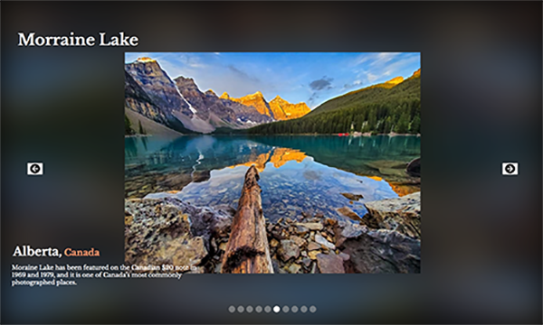

# Travel spots

This is an image slider built with [React](https://reactjs.org/)

<h1 align="center">

</h1>

### Demo

This is the working [demo](https://julianehiem.github.io/travel-spots/)

## Built with

- [HTML](https://developer.mozilla.org/en-US/docs/Web/HTML)
- [CSS](https://developer.mozilla.org/en-US/docs/Web/CSS)
- [JS](https://developer.mozilla.org/en-US/docs/Web/JavaScript)
- [React](https://reactjs.org/)

## License

This project is licensed under the terms of the **MIT** license.
MIT © [JulianEhiem](https://github.com/JulianEhiem)
